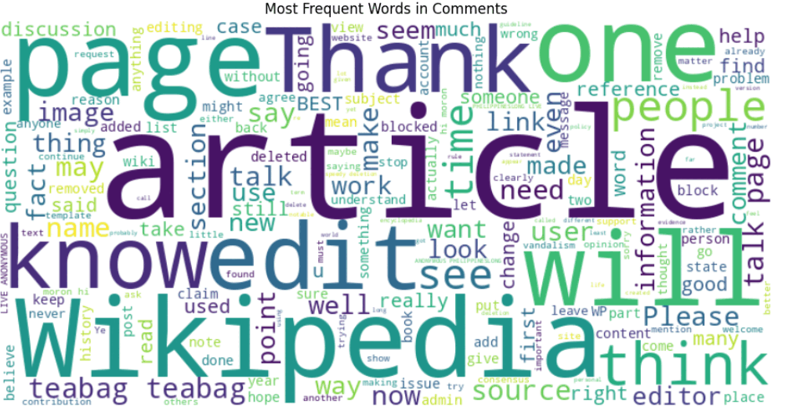

# 🧠 Toxic Comment Classification using NLP

[](https://github.com/SabihaMishu/Toxic_Comment_Classification_using_NLP)
[](LICENSE)
[](#requirements)

A compact, practical, and visually guided project to detect toxic comments using modern Natural Language Processing (NLP) techniques. This repo experiments with classical machine learning and transformer-based models to classify user comments into toxic vs. non-toxic (and optionally subtypes like insult, threat, obscene, etc.). Perfect for portfolio demos, data science learning, or as a starting point for moderation tools.

Why this project is interesting
- Real-world impact: helps keep online communities safer by filtering toxic content.
- Hands-on: from data cleaning and feature engineering to training BERT-style models.
- Comparative: see how classic approaches (TF-IDF + Logistic Regression) stack up against modern transformers.

---

## 🚀 Highlights
- Complete pipeline: data ingestion → cleaning → modeling → evaluation → inference
- Multiple models: baseline (TF-IDF + LR), LSTM, and transformer (BERT / DistilBERT)
- Eval metrics & visualizations: accuracy, precision/recall/F1, ROC/AUC, confusion matrices
- Notebook-friendly: step-by-step Jupyter notebooks and scripts for reproducibility

---


## 📸 Demo



---

## 🧩 Features
- Text preprocessing (normalization, tokenization, stopword handling, lemmatization)
- Class imbalance handling (class weights, oversampling)
- Hyperparameter tuning with cross validation
- Model serving demo (simple prediction script / notebook cell)
- Clear, reproducible experiments and result logs

---

## 📁 Repository structure (preview)
- data/ — datasets (or pointers to download)
- notebooks/ — exploratory analysis & model training notebooks
- src/
  - preprocessing.py
  - features.py
  - models.py
  - train.py
  - predict.py
- models/ — saved model checkpoints
- reports/ — evaluation plots and metrics
- README.md

---

## ⚡ Quick Start

Clone the repo:
```bash
git clone https://github.com/SabihaMishu/Toxic_Comment_Classification_using_NLP.git
cd Toxic_Comment_Classification_using_NLP
```

Create environment and install dependencies:
```bash
python -m venv venv
source venv/bin/activate   # macOS / Linux
venv\Scripts\activate      # Windows

pip install -r requirements.txt
```

Run the demo notebook:
```bash
jupyter lab notebooks/01-exploration.ipynb
```

Train a baseline model:
```bash
python src/train.py --model baseline --data data/toxic_comments.csv --output models/baseline.pkl
```

Predict on a single comment:
```bash
python src/predict.py --model models/baseline.pkl --text "I hate you and your posts!"
# Output: Toxic (probability: 0.96)
```

---

## 🧭 Datasets
This project can use one or more of the following (links & instructions in /data/README):
- Kaggle — Toxic Comment Classification Challenge dataset (multi-label)
- Jigsaw datasets (various toxicity types)
- Or your own exported comments in CSV (columns: id, text, label(s))

Note: For licensing and privacy compliance, do not publish private user data.

---

## 🛠 Models & Techniques
Short overview of what you'll find:
- Baseline: TF-IDF + Logistic Regression / SVM
- Deep learning: Embedding → LSTM / Bi-LSTM with attention
- Transformers: Fine-tuned DistilBERT / BERT (recommended for best accuracy)

Model selection tips:
- Use TF-IDF + LR for super-fast prototypes
- Use LSTM when you want sequence modeling but lack GPU power for transformers
- Use transformers when accuracy on nuanced toxic speech matters and GPU is available

---

## 📊 Evaluation & Results (example)
We track:
- Accuracy, Precision, Recall, F1-score (macro & per-class)
- ROC-AUC for binary classification tasks
- Confusion matrix and error analysis charts

Example summary:
- Baseline (TF-IDF + LR): F1 = 0.72
- LSTM (embeddings): F1 = 0.78
- DistilBERT (fine-tuned): F1 = 0.86

(Your results will vary based on dataset, preprocessing, and hyperparameters.)

---

## 🧭 How it works (pipeline)
1. Load and inspect data
2. Clean text: lowercasing, remove HTML, normalize punctuation, handle emojis
3. Tokenize & vectorize (TF-IDF / embeddings / tokenizer for transformers)
4. Train model with cross-validation and class-weighting or resampling
5. Evaluate and visualize misclassifications
6. Save model and run predictions

---

## 💡 Practical tips & ethics
- Always check for dataset biases: toxicity detection can be biased against certain dialects or groups.
- Evaluate models on representative data for your target community.
- Consider human-in-the-loop moderation rather than fully automatic takedowns.

---

## 🙌 Contributing
Contributions are welcome! Ideas:
- Add more model architectures (RoBERTa, ALBERT)
- Improve preprocessing and add language support
- Add unit tests and CI for training scripts
- Build a minimal web demo (Streamlit / FastAPI)

Suggested workflow:
1. Fork the repo
2. Create a feature branch
3. Add tests and documentation
4. Open a PR with a clear description

---

## 📜 License
This project is released under the MIT License. See LICENSE for details.

---

## ✉️ Contact & Acknowledgements
Created by SabihaMishu — contributions, issues, and ideas are welcome.  
Special thanks to the open datasets and the awesome NLP community.

Follow-up suggestions:
- Want a polished demo app (Streamlit) or Dockerfile to deploy models? I can create that next.
- Want a short presentation-ready result card for your portfolio? I can prepare it.

Happy exploring — and keep the internet kinder, one model at a time! 🌱
